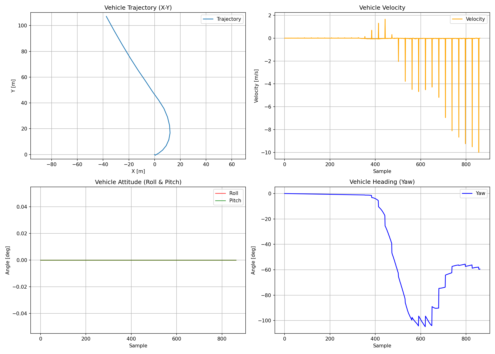

# gnss_imu_wheel_localizer

Sensor fusion localizer for Autoware using GNSS, IMU, and wheel odometry.

## Overview

EKF-based localization with 7D state vector `[x, y, z, roll, pitch, yaw, velocity]`. Supports 2D/3D estimation.

**Key design**: Yaw is estimated via angular velocity integration and GNSS position correction (no IMU quaternion dependency—suitable for automotive-grade IMUs).

## Quick Start

```bash
# Build
colcon build --packages-select gnss_imu_wheel_localizer

# Run
ros2 launch gnss_imu_wheel_localizer gnss_imu_wheel_localizer.launch.py

# With rosbag
ros2 launch gnss_imu_wheel_localizer gnss_imu_wheel_localizer.launch.py \
  play_rosbag:=true rosbag_path:=/path/to/rosbag.db3
```

## Topics

| Type | Topic | Message |
|------|-------|---------|
| Sub | `/sensing/gnss/ublox/nav_sat_fix` | `sensor_msgs/NavSatFix` |
| Sub | `/sensing/imu/tamagawa/imu_raw` | `sensor_msgs/Imu` |
| Sub | `/localization/kinematic_state` | `nav_msgs/Odometry` |
| Pub | `~/odometry` | `nav_msgs/Odometry` |
| Pub | `~/pose` | `geometry_msgs/PoseWithCovarianceStamped` |

## Parameters

See `config/gnss_imu_wheel_localizer.param.yaml`:

| Parameter | Description |
|-----------|-------------|
| `use_3d_position` | Enable Z estimation |
| `use_attitude` | Enable roll/pitch estimation |
| `publish_tf` | Broadcast TF |
| `enable_pose_csv_logging` | Enable CSV logging |

## Visualization

```bash
# Enable logging
ros2 launch ... enable_pose_csv_logging:=true pose_csv_path:=/tmp/pose.csv

# Plot
python3 scripts/plot_pose.py /tmp/pose.csv
```



## Dependencies

`rclcpp`, `sensor_msgs`, `nav_msgs`, `geometry_msgs`, `tf2`, `tf2_ros`, `Eigen3`, `GeographicLib`

## License

Apache 2.0
